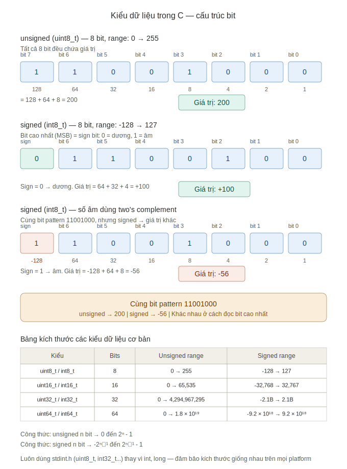

# GĐ1 — Nền Tảng Cú Pháp & Tư Duy C — Ghi Chú Bài Học

---

## Mục Lục

- [1.1 Cấu trúc chương trình C](#11-cấu-trúc-chương-trình-c)
  - [🔧 printf và stdout buffer](#printf-và-stdout-buffer)
- [1.2 Kiểu dữ liệu (Data Types)](#12-kiểu-dữ-liệu-data-types)
  - [📐 Kích thước không cố định](#kích-thước-không-cố-định)
  - [🔢 Signed vs Unsigned — ở mức bit](#signed-vs-unsigned--ở-mức-bit)
  - [⚠️ Trap: char signed hay unsigned?](#trap-char-signed-hay-unsigned)
  - [⚠️ Implicit conversion — signed vs unsigned](#implicit-conversion--signed-vs-unsigned)
  - [🔁 Integer Promotion Rule](#integer-promotion-rule)
- [1.3 Biến & Hằng (Variables & Constants)](#13-biến--hằng-variables--constants)
  - [🗂️ Storage Class](#storage-class)
  - [📌 Static trong function](#static-trong-function)
  - [🔒 const — nằm ở đâu và tại sao](#const--nằm-ở-đâu-và-tại-sao)
  - [🗺️ Memory Layout tổng quát](#memory-layout-tổng-quát)
  - [📦 Stack Frame — hàm gọi hàm](#stack-frame--hàm-gọi-hàm)
- [1.4 Toán Tử (Operators)](#14-toán-tử-operators)
  - [⚙️ Bitwise Operators & Promotion Trap](#bitwise-operators--promotion-trap)
  - [🔁 Promotion Rule — tóm tắt](#promotion-rule--tóm-tắt)
  - [⚠️ Signed/Unsigned Comparison Trap](#signedunsigned-comparison-trap)
  - [⚠️ Left Shift & Undefined Behavior](#left-shift--undefined-behavior)
  - [💥 Defined vs Undefined vs Implementation-Defined Behavior](#defined-vs-undefined-vs-implementation-defined-behavior)
  - [⚠️ Toán tử ++ và --](#toán-tử--và---)
  - [❓ Ternary Operator ? :](#ternary-operator--)
  - [⚠️ sizeof và size_t Trap](#sizeof-và-size_t-trap)
- [1.5 Control Flow](#15-control-flow)
  - [🔄 for loop](#for-loop)
  - [🔄 do-while](#do-while)
  - [⏭️ continue vs break](#continue-vs-break)
  - [🚀 goto — Error Handling Pattern](#goto--error-handling-pattern)
- [1.6 Giải Thuật Cơ Bản](#16-giải-thuật-cơ-bản)
  - [📊 Big-O Notation](#big-o-notation)
  - [🔍 Linear Search — O(n)](#linear-search--on)
  - [🫧 Bubble Sort — O(n²)](#bubble-sort--on)

---

## 1.1 Cấu trúc chương trình C

### printf và stdout buffer

`printf` không in ra màn hình ngay lập tức. Nó ghi vào **buffer** trong C runtime library.

**Buffer nằm ở đâu?**
- Buffer nằm trong **C runtime library** (CRT), không phải trong OS
- Khi khai báo `stdout`, C library tạo struct `FILE` chứa vùng memory (vài KB) làm buffer
- Vùng này nằm trên **heap** hoặc **data segment** — do C library quản lý
- **Tồn tại trên mọi platform** (Linux, Windows, embedded) — miễn là dùng C standard library

**Buffer flush khi nào?**
1. Gặp `\n` trong chuỗi
2. Buffer đầy
3. Chương trình kết thúc bình thường (`return` từ `main` hoặc gọi `exit()`)
4. Gọi `fflush(stdout)` thủ công

**Ví dụ: printf không có `\n`**
```c
#include <stdio.h>

int main(void)
{
    printf("Hello");  // ghi vào buffer, chưa hiện ra màn hình
    return 0;         // kết thúc → C runtime flush buffer → "Hello" hiện ra
}
```

**Nếu chương trình crash trước khi return:**
```c
printf("Hello");
int *p = NULL;
*p = 42;        // crash (segfault) → buffer chưa flush → "Hello" có thể KHÔNG hiện
```

**Hệ quả thực tế:**
- Khi debug bằng `printf`, luôn thêm `\n` hoặc `fflush(stdout)`
- Hoặc dùng `fprintf(stderr, ...)` vì `stderr` mặc định **unbuffered** — ghi ra ngay
- Trên embedded, không thấy output không có nghĩa code không chạy tới — có thể chỉ là buffer chưa flush

**Flow trên Linux:**
```
printf("Hello")
    → ghi vào buffer trong glibc (RAM của process)
    → khi flush → glibc gọi system call write()
    → Linux kernel → hiển thị trên terminal
```

**Flow trên Windows (DevC++ / MinGW):**
```
printf("Hello")
    → ghi vào buffer trong C runtime library (RAM của process)
    → khi flush → C library gọi Windows API (WriteFile / WriteConsole)
    → Windows kernel → hiển thị trên console window
```

Cơ chế buffer giống nhau trên cả hai — khác nhau chỉ ở bước cuối (gọi API nào của OS).

---

## 1.2 Kiểu dữ liệu (Data Types)

### Kích thước không cố định

C standard chỉ quy định **kích thước tối thiểu**, không phải kích thước cố định:

| Kiểu | Tối thiểu theo chuẩn | Thường gặp trên PC | Có thể khác trên embedded |
|---|---|---|---|
| `char` | 8 bit | 8 bit | 8 bit |
| `short` | 16 bit | 16 bit | 16 bit |
| `int` | 16 bit | 32 bit | 16 bit trên một số MCU 8/16-bit |
| `long` | 32 bit | 64 bit (Linux), 32 bit (Windows) | 32 bit |
| `long long` | 64 bit | 64 bit | 64 bit |

**Chú ý:** `long` trên Linux 64-bit = 8 bytes, trên Windows 64-bit = 4 bytes. Cùng kiểu, cùng 64-bit OS, kích thước khác nhau.

**Giải pháp:** Luôn dùng `stdint.h` khi cần kích thước chính xác:
```c
#include <stdint.h>

uint8_t  sensor_id;     // chắc chắn 8 bit, unsigned
int16_t  temperature;   // chắc chắn 16 bit, signed
uint32_t timestamp;     // chắc chắn 32 bit, unsigned
```

### Signed vs Unsigned — ở mức bit



**Unsigned (uint8_t):** tất cả 8 bit đều chứa giá trị.
```
Bit pattern: 1 1 0 0 1 0 0 0
Trọng số:  128 64 32 16  8  4  2  1
Giá trị:   128 + 64 + 8 = 200
```

**Signed (int8_t):** bit cao nhất (MSB) là **sign bit**.
- Sign bit = 0 → số dương, tính bình thường
- Sign bit = 1 → số âm, dùng **two's complement**: MSB có trọng số **-128**

```
Cùng bit pattern: 1 1 0 0 1 0 0 0
Trọng số:       -128 64 32 16  8  4  2  1
Giá trị:        -128 + 64 + 8 = -56
```

**Điểm quan trọng:** cùng bit pattern `11001000`, unsigned → 200, signed → -56. CPU không biết biến là signed hay unsigned — nó chỉ thấy bit. Compiler quyết định cách đọc.

**Bảng range:**
| Kiểu | Bits | Unsigned range | Signed range |
|---|---|---|---|
| uint8_t / int8_t | 8 | 0 → 255 | -128 → 127 |
| uint16_t / int16_t | 16 | 0 → 65,535 | -32,768 → 32,767 |
| uint32_t / int32_t | 32 | 0 → 4,294,967,295 | -2.1B → 2.1B |
| uint64_t / int64_t | 64 | 0 → 1.8 × 10¹⁹ | -9.2 × 10¹⁸ → 9.2 × 10¹⁸ |

**Công thức:**
- Unsigned n bit → 0 đến 2ⁿ - 1
- Signed n bit → -2ⁿ⁻¹ đến 2ⁿ⁻¹ - 1

### Trap: `char` signed hay unsigned?

```c
char c = 200;
if (c > 100) {
    printf("lớn hơn 100\n");
} else {
    printf("nhỏ hơn hoặc bằng 100\n");  // có thể vào đây
}
```

C standard quy định `char` có thể signed hoặc unsigned — **do compiler quyết định**:
- ARM (embedded): `char` mặc định **unsigned** → `c = 200`, so sánh đúng
- x86 (PC): `char` mặc định **signed** → `200` vượt range `[-128, 127]` → wrap thành `-56` → nhỏ hơn 100

**Fix:** dùng `uint8_t` hoặc `int8_t` thay vì `char` khi cần rõ ràng.

### Implicit conversion — signed vs unsigned

```c
int a = -1;
unsigned int b = 1;
if (a < b) {
    printf("a nhỏ hơn b\n");
} else {
    printf("a LỚN hơn b\n");  // ← cái này chạy
}
```

**Tại sao?** Khi compiler thấy phép so sánh giữa `int` và `unsigned int`, nó chuyển `int` thành `unsigned int` (gọi là **usual arithmetic conversion**):
- `-1` ở dạng bit (32-bit): `0xFFFFFFFF`
- Chuyển sang unsigned: `0xFFFFFFFF` = `4294967295`
- So sánh: `4294967295 > 1` → vào nhánh else

**`sizeof()` cũng trả về unsigned:**
```c
int a = -1;
if (a < sizeof(int)) {
    printf("nhỏ hơn\n");
} else {
    printf("lớn hơn\n");  // ← cái này chạy
}
```
`sizeof()` trả về `size_t` (unsigned) → cùng trap signed vs unsigned.

### Integer Promotion Rule

**Quy tắc:** trong bất kỳ biểu thức nào, nếu operand có kiểu **nhỏ hơn `int`** (`char`, `uint8_t`, `int8_t`, `uint16_t`, `int16_t`, `short`), compiler **tự động promote lên `int` trước khi tính**.

```c
uint8_t a = 250;
uint8_t b = 10;
uint8_t c = a + b;
int d = a + b;
```

**Flow thực tế:**
```
[1] a, b nhỏ hơn int → compiler tự promote lên int (implicit, không cần viết ép kiểu)
[2] int + int = int → 250 + 10 = 260
[3] Gán vào c (uint8_t) → implicit truncate → 260 mod 256 = 4
[4] Gán vào d (int) → 260 vừa trong int → d = 260
```

Kết quả: `c = 4`, `d = 260`.

**Tại sao C thiết kế vậy?**
CPU không có phép cộng 8-bit riêng — hầu hết CPU (x86, ARM) thực hiện phép tính trên register tối thiểu 32-bit. C standard quy định promote lên `int` (kích thước tự nhiên của CPU) rồi mới tính.

**Hai loại conversion:**
- **Explicit cast:** bạn tự viết → `int x = (int)f;`
- **Implicit conversion:** compiler tự làm → xảy ra ở 2 thời điểm:
  - Lúc **tính toán**: promotion lên int
  - Lúc **gán**: truncate xuống nếu biến đích nhỏ hơn

**Hệ quả thực tế:**
```c
uint8_t a = 250;
uint8_t b = 10;

if ((a + b) > 255) {
    // VÀO ĐÂY — vì a + b = 260 (int), chưa truncate
}

uint8_t c = a + b;
if (c > 255) {
    // KHÔNG VÀO — vì c đã truncate thành 4
}
```

Cùng phép cộng, kết quả khác nhau tùy thời điểm kiểm tra — trước hay sau khi gán vào biến 8-bit.

---

## 1.3 Biến & Hằng (Variables & Constants)

### Storage Class

Mỗi biến trong C có **storage class** — xác định vòng đời (lifetime) và nơi lưu trữ (memory location).

| Storage Class | Từ khóa | Vị trí bộ nhớ | Vòng đời |
|---|---|---|---|
| Automatic | `auto` (mặc định) | Stack | Từ khi khai báo đến khi ra khỏi scope |
| Static (local) | `static` trong function | Data segment | Suốt vòng đời chương trình |
| Static (file scope) | `static` ngoài function | Data segment | Suốt vòng đời chương trình, chỉ visible trong file |
| External | `extern` | Data segment | Suốt vòng đời chương trình |
| Register | `register` | Register (gợi ý) | Như auto |

### Static trong function

```c
void foo(void) {
    static int a = 0;  // khởi tạo MỘT LẦN khi chương trình khởi động
    int b = 0;         // khởi tạo mỗi lần gọi foo()
    a++;
    b++;
    printf("a=%d b=%d\n", a, b);
}
// Gọi foo() 3 lần:
// a=1 b=1
// a=2 b=1
// a=3 b=1
```

**Điểm quan trọng:**
- `static int a = 0` → khởi tạo **một lần duy nhất** khi chương trình khởi động, không phải mỗi lần gọi hàm
- `int b = 0` → khởi tạo lại mỗi lần gọi, vòng đời kết thúc khi hàm return

**Có thể tác động vào biến static từ function khác không?**

```c
// Cách 1: Trả về pointer (không recommended)
int* get_counter(void) {
    static int count = 0;
    return &count;  // nguy hiểm — caller có thể ghi bừa
}

// Cách 2: Thiết kế function có parameter reset (đúng cách — phổ biến trong embedded driver)
void counter(int reset) {
    static int count = 0;
    if (reset) count = 0;
    else count++;
    printf("count = %d\n", count);
}
```

### const — nằm ở đâu và tại sao

```c
void foo(void) {
    const int x = 10;  // const local → Stack
}

const int MAX = 100;   // const global → Text segment (.rodata)
const char* str = "Hello";  // string literal → Text segment (.rodata)
```

**Tại sao `const` global nằm trong Text segment?**

1. Compiler thấy giá trị không đổi → đặt vào section `.rodata` (read-only data)
2. Linker gộp `.rodata` + `.text` vào Text segment
3. OS đánh dấu read-only ở mức MMU — ghi vào sẽ **segfault**

**Lý do thiết kế:**
- **Tiết kiệm RAM**: nhiều instance của cùng chương trình dùng chung 1 bản Text segment (OS map vào cùng vùng nhớ vật lý qua MMU)
- **Bảo mật**: không bị ghi đè
- **Phát hiện bug sớm**: crash thay vì bug âm thầm

**`const int` vs `int const`:** giống nhau hoàn toàn. Sự khác biệt chỉ xuất hiện khi kết hợp với pointer (học ở GĐ5).

### Memory Layout tổng quát

```
High address
┌─────────────────┐
│      Stack      │ ← local variables, function args, return address
│        ↓        │
│                 │
│        ↑        │
│      Heap       │ ← dynamic allocation (malloc/free)
├─────────────────┤
│  Data Segment   │ ← global/static variables đã khởi tạo
├─────────────────┤
│   BSS Segment   │ ← global/static variables chưa khởi tạo (= 0)
├─────────────────┤
│  Text Segment   │ ← code (instructions) + .rodata (const, string literals)
└─────────────────┘
Low address
```

### Stack Frame — hàm gọi hàm

**Phân biệt 2 thứ:**
- **Code** (instructions) của hàm → Text segment (tất cả hàm kể cả `main`)
- **Data khi chạy** (biến local, return address) → Stack frame

**Flow khi main() gọi calc(), calc() gọi add():**
```
[1] main() tạo stack frame của nó
[2] main() gọi calc() → push return address, tạo frame của calc()
[3] calc() gọi add() → push return address, tạo frame của add()
[4] add() return → pop frame của add(), SP quay về calc()
[5] calc() return → pop frame của calc(), SP quay về main()
```

**Trước `main()` còn có `_start()`** — entry point thật sự do C runtime tạo, khởi tạo mọi thứ (BSS, argc/argv, libc) rồi mới gọi `main()`.

---

## 1.4 Toán Tử (Operators)

### Bitwise Operators & Promotion Trap

```c
unsigned char x    = 0x05;  // 0000 0101
unsigned char mask = 0x03;  // 0000 0011

unsigned char result1 = x & mask;   // 0x01
unsigned char result2 = x | mask;   // 0x07
unsigned char result3 = x ^ mask;   // 0x06
unsigned char result4 = ~mask;      // 0xFC (xem trap bên dưới)
unsigned char result5 = x << 2;     // 0x14
unsigned char result6 = x >> 1;     // 0x02
```

**Promotion trap với `~`:**

```c
unsigned char mask = 0x03;
printf("%u\n", ~mask);  // in ra 4294967292, không phải 252!
```

Flow:
```
1. mask (uint8_t) → promote lên int 32-bit: 0x00000003
2. ~mask → flip 32 bit: 0xFFFFFFFC = 4294967292
3. printf("%u") in giá trị int 32-bit → 4294967292
```

Nếu gán vào `unsigned char`: truncate về 8-bit → `0xFC = 252` ✅

**Bug kinh điển trong embedded:**
```c
uint8_t flags = 0xFF;
if (~flags) {          // luôn true! vì ~flags = 0xFFFFFF00 (int 32-bit)
    // code này vẫn chạy dù tất cả bit đã set
}

// Fix đúng cách:
if ((uint8_t)~flags) { ... }
// hoặc
if (~flags & 0xFF)   { ... }
```

### Promotion Rule — tóm tắt

**Quy tắc:** Chỉ promote khi kiểu **nhỏ hơn `int`**.

| Kiểu | So với `int` 32-bit | Kết quả |
|---|---|---|
| `uint8_t`, `uint16_t` | Nhỏ hơn | Promote lên `int` |
| `int32_t`, `uint32_t` | Bằng hoặc lớn hơn | Giữ nguyên |
| `uint64_t` | Lớn hơn | Giữ nguyên |

**Promotion xảy ra ở đâu trong phần cứng?**
- Biến sống trên **Stack** (RAM)
- Khi tính toán, CPU load vào **Register** (32-bit hoặc 64-bit)
- Promotion xảy ra trong register — không phải stack
- Kết quả truncate về rồi ghi lại vào stack

**Promotion có trên mọi nền tảng không?**

Có — kể cả CPU 8-bit (AVR Arduino). C standard bắt buộc. Trên AVR, `int` = 16-bit, compiler **ghép 2 register 8-bit** để giả lập.

**Cách biết nền tảng promote lên bao nhiêu bit:**
```c
printf("int = %zu bytes = %zu bits\n", sizeof(int), sizeof(int) * 8);
```

### Signed/Unsigned Comparison Trap

**Usual Arithmetic Conversions — rule thực tế:**

```
uint8_t  vs int  → uint8_t promote lên int  → cả 2 signed (KHÔNG có trap)
uint16_t vs int  → uint16_t promote lên int → cả 2 signed (KHÔNG có trap)
uint32_t vs int  → int convert sang uint32_t → cả 2 unsigned (CÓ trap!)
```

**Trap thật sự chỉ xảy ra với `uint32_t` (hoặc lớn hơn) gặp `int`:**
```c
uint32_t x = 200;
int y = -1;
if (x > y) { ... }  // y convert sang uint32_t → 4294967295 → x < y → false!
```

### Left Shift & Undefined Behavior

**Rule shift:**
```c
uint8_t flags = 0x01;
flags = flags << 7;
// flow: promote lên int → 0x00000001 → shift 7 → 0x00000080 → truncate → 0x80
```

**Undefined Behavior với shift:**
```c
uint32_t x = 1;
x = x << 32;  // UB! shift amount >= số bit của kiểu → undefined behavior
```

### Defined vs Undefined vs Implementation-Defined Behavior

| Loại | Ý nghĩa | Ví dụ |
|---|---|---|
| **Defined** | C standard quy định rõ kết quả | `uint8_t` wrap around khi overflow |
| **Implementation-Defined** | Compiler chọn, phải document | `sizeof(int)` |
| **Undefined (UB)** | Không quy định — compiler làm gì cũng được | Shift ≥ số bit, chia cho 0 |

**Tại sao UB nguy hiểm?** Compiler **giả định UB không bao giờ xảy ra** và dùng giả định đó để tối ưu — có thể xóa cả đoạn code quan trọng mà không báo lỗi.

### Toán tử `++` và `--`

```c
int i = 5;
printf("%d %d\n", i++, ++i);  // Undefined Behavior!
```

C standard **không quy định thứ tự tính argument của hàm** — compiler tự chọn. Dùng `++`/`--` nhiều lần trên cùng biến trong 1 expression → UB.

**Rule:** Không bao giờ dùng `++`/`--` trên cùng biến nhiều lần trong một expression.

### Ternary Operator `? :`

```c
uint8_t a = 100;
uint8_t b = 200;
uint8_t result = (a > b) ? a : a + b;
```

Flow:
```
1. (a > b) → false → vào vế phải: a + b
2. a, b promote lên int → 100 + 200 = 300 (int)
3. gán vào uint8_t → truncate: 300 mod 256 = 44
```

**Fix:**
```c
uint8_t result = (a > b) ? a : (uint8_t)(a + b);
```

### `sizeof` và `size_t` Trap

`sizeof` trả về kiểu **`size_t`** — không phải `int`.

**`size_t` là gì?**
- Alias của kiểu unsigned phù hợp với kiến trúc
- 32-bit system: `unsigned int` (4 bytes)
- 64-bit system: `unsigned long` (8 bytes)

**Subtraction trap:**
```c
size_t n = sizeof(arr) / sizeof(arr[0]);  // n = 5, unsigned

if (n - 6 > 0) {  // bug! 5 - 6 với unsigned → wrap around → số khổng lồ → true
    // vào đây dù logic sai
}

// Fix:
if ((int)n - 6 > 0) { ... }   // cast về signed
if (n > 6) { ... }             // đổi chiều so sánh
```

---

## 1.5 Control Flow

### `for` loop

```
A (1 lần) → B (kiểm tra) → body → C → B (kiểm tra) → body → C → ... → B false → thoát
```

**Trap: không bao giờ modify biến loop trong body**
```c
for (int i = 0; i < 10; i++) {
    if (i == 5) i = i - 1;  // bug! vòng lặp vô tận tại i=5
}
```

### `do-while`

Khác `while`: body chạy **tối thiểu 1 lần** vì kiểm tra điều kiện **sau** body.

**Dùng phổ biến trong macro (Linux kernel pattern):**
```c
#define RESET_DEVICE() do { \
    clear_flags();          \
    init_hardware();        \
} while(0)
```

**Tại sao dùng `do { } while(0)` thay vì `{ }`?**

Dùng `{ }` bình thường sẽ bug khi có `if/else`:
```c
if (error)
    { clear_flags(); init_hardware(); };  // dấu ; thừa → else bị mồ côi → compiler error
else
    do_something();
```

Dùng `do { } while(0)`:
```c
if (error)
    do { clear_flags(); init_hardware(); } while(0);  // hợp lệ
else
    do_something();
```

**Rule:** Macro nhiều dòng luôn dùng `do { } while(0)` — convention trong Linux kernel và mọi embedded codebase chuyên nghiệp.

### `continue` vs `break`

- `break` → **thoát hẳn** vòng lặp
- `continue` → **bỏ qua iteration hiện tại**, nhảy lên kiểm tra điều kiện tiếp theo

```c
for (int i = 0; i < 5; i++) {
    if (i == 2) continue;
    printf("%d\n", i);  // in: 0 1 3 4
}
```

### `goto` — Error Handling Pattern

`goto` nhảy thẳng đến label. Bị coi là "xấu" khi dùng bừa bãi (spaghetti code), nhưng **được dùng rộng rãi trong Linux kernel** cho error handling và cleanup.

**Pattern chuẩn trong embedded/Linux kernel:**
```c
int init_device(void) {
    if (open_port() < 0)    goto cleanup_port;
    if (alloc_buffer() < 0) goto cleanup_buffer;
    if (start_dma() < 0)    goto cleanup_dma;
    return 0;

cleanup_dma:
    stop_dma();
cleanup_buffer:
    free_buffer();
cleanup_port:
    close_port();
    return -1;
}
```

**Tại sao tốt hơn `if/else` lồng nhau?**
- Các label **cascade (fall through)** xuống tự động — không cần gọi lại cleanup functions
- Thêm bước mới chỉ cần thêm 1 dòng `goto` và 1 label — không phải sửa tất cả error case
- Code ngắn hơn, ít lặp hơn, khó quên cleanup hơn

---

## 1.6 Giải Thuật Cơ Bản

### Big-O Notation

Big-O biểu thị **độ phức tạp** của không gian (space) và thời gian (time) khi một function thực thi.

- Không dùng con số cụ thể (không phải O(5) hay O(100))
- Dùng **ký hiệu tổng quát** theo số phần tử n

| Big-O | Tên | Ví dụ |
|---|---|---|
| O(1) | Constant | Truy cập phần tử mảng theo index |
| O(n) | Linear | Linear Search |
| O(n²) | Quadratic | Bubble Sort |
| O(log n) | Logarithmic | Binary Search |

### Linear Search — O(n)

```c
int arr[5] = {1, 2, 3, 4, 5};
int target = 3;

for (int i = 0; i < 5; i++) {
    if (arr[i] == target) {
        return i;
    }
}
```

Worst case: duyệt hết n phần tử → O(n).

### Bubble Sort — O(n²)

**Ý tưởng:** so sánh 2 phần tử liền kề, đổi chỗ ngay nếu sai thứ tự. Lặp lại cho đến khi sắp xếp xong. Phần tử lớn nhất "nổi" về cuối sau mỗi vòng.

**Trace tay với `[5, 3, 1, 4, 2]` — vòng 1:**
```
So sánh 5,3 → đổi → [3, 5, 1, 4, 2]
So sánh 5,1 → đổi → [3, 1, 5, 4, 2]
So sánh 5,4 → đổi → [3, 1, 4, 5, 2]
So sánh 5,2 → đổi → [3, 1, 4, 2, 5]  ← 5 đã về đúng vị trí
```

**Implementation:**
```c
void bubble_sort(int arr[], int n) {
    for (int i = 0; i < n; i++) {
        for (int j = 0; j < n - i - 1; j++) {  // n-i-1: giảm vùng so sánh + tránh out-of-bounds
            if (arr[j] > arr[j + 1]) {
                int tmp = arr[j];
                arr[j]     = arr[j + 1];
                arr[j + 1] = tmp;
            }
        }
    }
}
```

**Tại sao `j < n - i - 1`?**
- `n - i`: sau mỗi vòng i, i phần tử đã về đúng vị trí → giảm vùng so sánh
- `- 1`: tránh truy cập `arr[j+1]` vượt ngoài mảng

**Tại sao O(n²)?**
```
Vòng 1: n-1 phép so sánh
Vòng 2: n-2 phép so sánh
...
Tổng = (n-1) + (n-2) + ... + 1 = n(n-1)/2 → O(n²)
```

**Bubble Sort trong thực tế:** gần như không dùng vì O(n²) quá chậm. Giá trị học tập: hiểu tư duy thuật toán và lý do tại sao các thuật toán O(n log n) như Merge Sort, Quick Sort tốt hơn.

