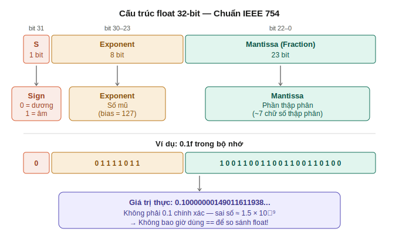

# GĐ2 — I/O Functions — Ghi Chú Bài Học

---

## Mục Lục

- [2.1 Format Specifiers](#21-format-specifiers)
  - [📌 Specifier cơ bản và đúng kiểu](#-specifier-cơ-bản-và-đúng-kiểu)
  - [⚠️ Trap: dùng sai specifier](#️-trap-dùng-sai-specifier)
  - [🔢 Width và zero-padding](#-width-và-zero-padding)
  - [📐 %x và in hex trong embedded](#-x-và-in-hex-trong-embedded)
- [2.2 Float & printf](#22-float--printf)
  - [🗺️ Cấu trúc IEEE 754](#️-cấu-trúc-ieee-754)
  - [⚠️ Trap: so sánh float bằng ==](#️-trap-so-sánh-float-bằng-)
  - [🔧 Fix: dùng epsilon](#-fix-dùng-epsilon)
  - [⚠️ Trap: float literal không có f](#️-trap-float-literal-không-có-f)
- [2.3 scanf](#23-scanf)
  - [📌 Tại sao scanf cần &](#-tại-sao-scanf-cần-)
  - [⚠️ Trap: buffer overflow với %s](#️-trap-buffer-overflow-với-s)
  - [🔧 Fix: fgets thay vì scanf](#-fix-fgets-thay-vì-scanf)
  - [⚠️ Trap: \n trong buffer của fgets](#️-trap-n-trong-buffer-của-fgets)
  - [📊 So sánh scanf vs fgets](#-so-sánh-scanf-vs-fgets)
- [2.4 stdin / stdout / stderr](#24-stdin--stdout--stderr)
  - [📌 3 stream mặc định](#-3-stream-mặc-định)
  - [🔧 Buffer khác nhau](#-buffer-khác-nhau)
  - [🗺️ Redirect stream](#️-redirect-stream)

---

## 2.1 Format Specifiers

### 📌 Specifier cơ bản và đúng kiểu

`printf` không kiểm tra kiểu biến — nó chỉ đọc **bit pattern** theo format specifier bạn chỉ định. Dùng sai specifier → đọc sai bit pattern → kết quả sai hoàn toàn.

| Kiểu biến | Specifier đúng | Ghi chú |
|---|---|---|
| `int`, `int32_t` | `%d` | Signed decimal |
| `unsigned int`, `uint32_t` | `%u` | Unsigned decimal |
| `long` | `%ld` | |
| `uint64_t` | `%llu` | |
| `size_t` | `%zu` | Quan trọng — không dùng `%d` |
| `float` | `%f` | |
| `double` | `%lf` (scanf) / `%f` (printf) | |
| `char*` (string) | `%s` | |
| pointer / địa chỉ | `%p` | In dạng hex address |
| hex | `%x` / `%X` | Chữ thường / chữ hoa |
| octal | `%o` | Ít dùng trong embedded |
| scientific | `%e` | `1.234e+05` |

### ⚠️ Trap: dùng sai specifier

```c
int x = -1;
printf("%d\n", x);   // -1           ← đúng
printf("%u\n", x);   // 4294967295   ← đọc bit pattern 0xFFFFFFFF như unsigned
```

Cùng bit pattern `0xFFFFFFFF`:
- `%d` đọc như signed → `-1`
- `%u` đọc như unsigned → `4294967295`

**Trap với `size_t`:**
```c
size_t n = 10;
printf("%d\n", n);   // sai! size_t là unsigned, trên 64-bit = 8 bytes, %d chỉ đọc 4 bytes
printf("%zu\n", n);  // đúng
```

### 🔢 Width và zero-padding

```
%[flags][width][.precision]specifier
```

| Format | Ý nghĩa | Ví dụ (x=0xAB) |
|---|---|---|
| `%x` | Hex chữ thường | `ab` |
| `%X` | Hex chữ hoa | `AB` |
| `%02X` | Tối thiểu 2 ký tự, pad `0` | `AB` |
| `%08X` | Tối thiểu 8 ký tự, pad `0` | `000000AB` |
| `%10d` | Tối thiểu 10 ký tự, pad space | `        10` |
| `%-10d` | Căn trái, pad space | `10        ` |

**Quy tắc:** Con số sau `%0` = tổng chiều rộng tối thiểu, thiếu thì pad `0` phía trước.

### 📐 %x và in hex trong embedded

Trong embedded, `%02X` và `%08X` cực kỳ phổ biến khi debug register:

```c
uint8_t  reg8  = 0xAB;
uint32_t reg32 = 0x12345678;
void    *addr  = &reg8;

printf("REG8  = 0x%02X\n",  reg8);    // REG8  = 0xAB
printf("REG32 = 0x%08X\n",  reg32);   // REG32 = 0x12345678
printf("ADDR  = %p\n",      addr);    // ADDR  = 0x7ffd1234abcd
```

---

## 2.2 Float & printf

### 🗺️ Cấu trúc IEEE 754



`float` 32-bit được chia thành 3 phần theo chuẩn IEEE 754:

```
bit 31      bit 30-23      bit 22-0
  S          EEEEEEEE      MMMMMMMMMMMMMMMMMMMMMMM
 1 bit        8 bit              23 bit
 Sign        Exponent          Mantissa
```

- **Sign (1 bit):** `0` = dương, `1` = âm
- **Exponent (8 bit):** số mũ, bias = 127
- **Mantissa (23 bit):** phần thập phân (~7 chữ số thập phân)

**Vấn đề cốt lõi:** 23 bit mantissa chỉ biểu diễn được **2²³ ≈ 8 triệu** giá trị khác nhau. Hầu hết số thập phân **không thể biểu diễn chính xác** — CPU lưu giá trị **gần nhất có thể**.

```c
float x = 0.1f;
printf("%.20f\n", x);
// Output: 0.10000000149011611938  ← không phải 0.1 chính xác
```

**Tại sao x86 và MCU có kết quả khác nhau khi so sánh float?**

- **x86 FPU 80-bit:** tính `0.1f + 0.2f` với precision 80-bit → kết quả trung gian chính xác hơn → khi round về 32-bit có thể bằng `0.3f`
- **MCU FPU 32-bit:** tính thẳng 32-bit → sai số tích lũy khác nhau → `0.1f + 0.2f ≠ 0.3f`

```
0.1f thực tế = 0.100000001490...
0.2f thực tế = 0.200000002980...
0.3f thực tế = 0.300000011920...

MCU 32-bit:
0.1f + 0.2f = 0.300000004470  ≠  0.300000011920 (0.3f)  → KHÔNG bằng

x86 80-bit:
0.1f + 0.2f → tính 80-bit → round về 32-bit → 0.300000011920 == 0.3f  → BẰNG (tình cờ)
```

### ⚠️ Trap: so sánh float bằng `==`

```c
float a = 0.1f + 0.2f;
float b = 0.3f;

if (a == b) { ... }  // KHÔNG đáng tin — kết quả khác nhau tùy nền tảng!
```

**Không bao giờ dùng `==` để so sánh float.**

### 🔧 Fix: dùng epsilon

Thay vì hỏi "2 số có bằng nhau không?", hỏi "2 số có **đủ gần nhau** không?":

```c
#include <math.h>

#define EPSILON 1e-6f

if (fabsf(a - b) < EPSILON) {
    // "bằng nhau" trong ngưỡng chấp nhận được
}
```

`fabsf()` = lấy giá trị tuyệt đối của `float` (`fabs()` cho `double`).

**Chọn epsilon bao nhiêu?**

| Bài toán | Epsilon phù hợp |
|---|---|
| Tính toán float thông thường | `1e-6f` |
| Cảm biến nhiệt độ (sai số 0.1°C) | `0.01f` |
| Cảm biến ADC 12-bit | `0.001f` |
| Tài chính | Không dùng float — dùng `int` × 100 |

### ⚠️ Trap: float literal không có `f`

Trong C, mọi số thực literal **mặc định là `double`**, không phải `float`:

```c
3.14    // double (64-bit)
3.14f   // float  (32-bit)
1e-6    // double
1e-6f   // float
```

**Vấn đề trong embedded:**

```c
float a = 0.1f + 0.2f;
float b = 0.3f;

if (fabsf(a - b) < 1e-6)   // 1e-6 là double → float convert lên double → chậm!
if (fabsf(a - b) < 1e-6f)  // 1e-6f là float → tính thẳng trên FPU float → nhanh
```

Khi so sánh `float` vs `double`:
- `float` bị **convert lên `double`** (implicit conversion lên kiểu chính xác hơn)
- Trên MCU không có FPU double → compiler dùng **software emulation** → **chậm hơn 10-100 lần**

**Rule trong embedded: luôn thêm `f` vào mọi float literal.**

```c
// Sai:
float x = 3.14;        // 3.14 là double, gán vào float → implicit convert
float y = x * 2.0;     // 2.0 là double → tính toán bằng double

// Đúng:
float x = 3.14f;
float y = x * 2.0f;
```

**So sánh `0.1f` vs `0.1`:**

```
0.1f = 0.100000001490116...  (32-bit, sai số lớn hơn → lớn hơn 0.1 thật)
0.1  = 0.100000000000000...  (64-bit, gần 0.1 thật hơn)
→ 0.1f > 0.1
```

Không phải float luôn lớn hơn double — tùy giá trị, sai số có thể dương hoặc âm.

---

## 2.3 scanf

### 📌 Tại sao scanf cần `&`

```c
int x;
scanf("%d", &x);   // cần &x
printf("%d", x);   // chỉ cần x
```

- `printf` → **đọc** giá trị → chỉ cần giá trị `x`
- `scanf` → **ghi** giá trị vào biến → cần địa chỉ `&x` để biết ghi vào đâu

### ⚠️ Trap: buffer overflow với `%s`

```c
char name[8];
scanf("%s", name);  // NGUY HIỂM!
```

`scanf("%s")` dừng khi gặp **khoảng trắng** (space, tab, newline) — không đọc được tên có dấu cách.

Nếu người dùng nhập chuỗi dài hơn buffer:
```
name[8] trên stack:
[N][g][u][y][e][n][n][n]  ← hết buffer (8 bytes)
[n][n][n][n][n][\0]       ← tràn sang vùng nhớ khác! (buffer overflow)
```

Hậu quả:
- Ghi đè biến khác trên stack → **data corruption**
- Ghi đè return address → **crash hoặc bị hack**
- Trên embedded: ghi đè vùng nhớ quan trọng → **MCU hành xử bất thường**

**Fix tạm — giới hạn độ dài trong format:**
```c
char name[8];
scanf("%7s", name);  // đọc tối đa 7 ký tự + '\0'
```

### 🔧 Fix: fgets thay vì scanf

```c
char name[8];
fgets(name, sizeof(name), stdin);  // an toàn — tự giới hạn theo sizeof
```

`fgets` đọc cả **khoảng trắng**, dừng khi gặp `\n` hoặc đủ `sizeof - 1` ký tự.

**Khi nào dùng `fgets`:**
- Input có khoảng trắng (họ tên, địa chỉ, câu lệnh)
- Đọc từng dòng file config (`baudrate=115200`)
- Nhận lệnh từ UART terminal (`set led 1`, `read sensor`)
- Parse dòng CSV (`2024,01,15,36.5`)

**Ví dụ UART command trong embedded:**
```c
char cmd[32];
fgets(cmd, sizeof(cmd), stdin);
cmd[strcspn(cmd, "\n")] = '\0';  // xóa \n

if (strcmp(cmd, "reset") == 0) {
    reset_system();
} else if (strcmp(cmd, "status") == 0) {
    print_status();
}
```

### ⚠️ Trap: `\n` trong buffer của fgets

`fgets` **lưu `\n`** vào buffer:

```c
char name[8];
fgets(name, sizeof(name), stdin);
// Người dùng nhập "An" + Enter
// name = ['A', 'n', '\n', '\0']  ← có '\n'!

if (strcmp(name, "An") == 0)  // false! vì name = "An\n"
```

**Fix — xóa `\n` sau khi đọc:**
```c
name[strcspn(name, "\n")] = '\0';
// strcspn trả về index của '\n' đầu tiên → gán '\0' vào đó
```

### 📊 So sánh scanf vs fgets

| | `scanf("%s")` | `fgets` |
|---|---|---|
| Khoảng trắng | Dừng lại | Đọc được |
| Giới hạn độ dài | Cần thêm `%7s` | Tự động qua `sizeof` |
| `\n` trong buffer | Không lưu | **Lưu vào buffer** |
| An toàn | Nguy hiểm nếu không giới hạn | An toàn hơn |
| Dùng trong embedded | Gần như không dùng | Phổ biến cho UART input |

**Thực tế:** `scanf` chủ yếu dùng khi học C trên PC. Trong embedded production code, dùng `fgets` hoặc parse binary protocol trực tiếp.

---

## 2.4 stdin / stdout / stderr

### 📌 3 stream mặc định

Khi chương trình C chạy, OS tự động mở 3 stream:

```
Keyboard ──────► [ stdin  ] ──► chương trình
                 [ stdout ] ──► Terminal (line buffered)
                 [ stderr ] ──► Terminal (unbuffered)
```

| Stream | Hướng | Dùng cho |
|---|---|---|
| `stdin` | Input vào chương trình | `scanf`, `fgets(..., stdin)` |
| `stdout` | Output ra terminal | `printf`, `fprintf(stdout, ...)` |
| `stderr` | Error ra terminal | `fprintf(stderr, ...)` |

```c
printf("Hello\n");              // ghi vào stdout
scanf("%d", &x);                // đọc từ stdin
fgets(buf, 8, stdin);           // đọc từ stdin
fprintf(stderr, "Error!\n");    // ghi vào stderr
```

### 🔧 Buffer khác nhau

| | Buffer | Flush khi nào |
|---|---|---|
| `stdout` | **Line buffered** | Gặp `\n`, buffer đầy, `fflush()`, exit |
| `stderr` | **Unbuffered** | **Ngay lập tức** |

**Tại sao `stderr` unbuffered?**

Lỗi cần hiện ra **ngay lập tức** — nếu chương trình crash sau khi ghi lỗi, buffer `stdout` chưa kịp flush → mất thông báo lỗi:

```c
// Nguy hiểm:
printf("ERROR: null pointer!\n");  // còn trong buffer stdout!
*p = 42;  // crash → buffer chưa flush → MẤT thông báo lỗi

// Đúng:
fprintf(stderr, "ERROR: null pointer!\n");  // in ngay lập tức
*p = 42;  // crash — nhưng thông báo lỗi đã hiện rồi ✅
```

**Rule debug trong embedded:**
```c
// Khi debug, dùng stderr để chắc chắn thấy output dù crash:
fprintf(stderr, "[DEBUG] value = %d\n", val);

// Hoặc nếu dùng printf, fflush ngay sau:
printf("[DEBUG] value = %d\n", val);
fflush(stdout);
```

### 🗺️ Redirect stream

`stdout` và `stderr` đều in ra terminal — nhưng có thể **redirect độc lập** nhau:

```bash
./program > output.txt          # stdout vào file, stderr ra terminal
./program 2> error.txt          # stderr vào file, stdout ra terminal
./program > out.txt 2> err.txt  # cả 2 vào file riêng
./program > /dev/null 2> err.txt # bỏ stdout, chỉ giữ lỗi
```

**Ứng dụng thực tế — chạy firmware test 8 tiếng:**

```c
printf("Temperature: 36.5\n");          // stdout → log bình thường
fprintf(stderr, "ERROR: I2C timeout!"); // stderr → lỗi nghiêm trọng
```

```bash
./sensor_program > sensor_log.txt 2> error_log.txt
```

- `sensor_log.txt` → hàng nghìn dòng data bình thường
- `error_log.txt` → **chỉ có lỗi**, dễ tìm ngay:

```
ERROR: I2C timeout!
ERROR: I2C timeout!
ERROR: SPI checksum mismatch!
```

**Trong CI/CD pipeline:**
```bash
./run_tests > /dev/null 2> failures.txt
# Nếu failures.txt rỗng → pass
# Nếu có nội dung → fail, gửi email báo lỗi
```

**Tóm lại ý nghĩa:**
> `stdout` = data bình thường — có thể pipe, redirect, xử lý tiếp  
> `stderr` = thông báo lỗi — luôn cần người đọc ngay, không được lọc mất
